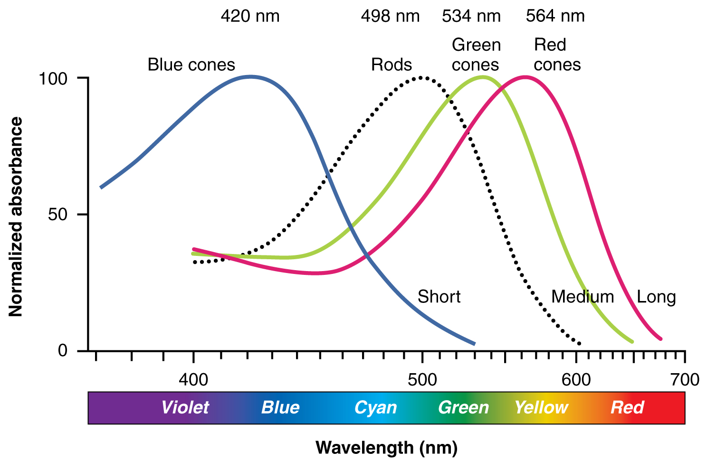
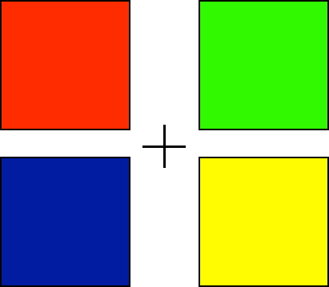

## Today's Topics

- Wrap up on vision
- The neuroscience of action
- Quiz 2 available Friday

## The *fovea* {.smaller}

<http://www.brainhq.com/sites/default/files/fovea.jpg>

## The fovea

- Central 1-2 deg of visual field
- Aligned with visual axis
- *Retinal ganglion cells* pushed aside
- Highest *acuity* vision == best for details

## Acuity varies across fovea

## Acuity varies across fovea {.smaller}

<http://michaeldmann.net/pix_7/blndspot.gif>

## What part of the skin is like the fovea?

## What part of the skin is like the fovea?

<http://jov.arvojournals.org/data/Journals/JOV/933499/jov-3-10-1-fig001.jpeg>

## *Photoreceptors* detect light

## Photoreceptors detect light

- *Rods*
    + ~120 M/eye
    + Mostly in periphery
    + Active in low light conditions
    + One wavelength range
    
## Photoreceptors detect light

- *Cones*
    + ~5 M/eye
    + Mostly in center
    + 3 wavelength ranges
    
## Photoreceptors "specialize" in particular wavelengths {.smaller}

Anatomy & Physiology, Connexions Web site. http://cnx.org/content/col11496/1.6/, Jun 19, 2013.

    
## How photoreceptors work

- Outer segment
    + Membrane disks
    + *Photopigments*
        - Sense light, trigger chemical cascade
- Inner segment
    + Synaptic terminal
- Light *hyperpolarizes* photoreceptor!
    + The *dark current*
    
## Retina

- Physiologically *backwards*
    + How?
- Anatomically *inside-out*
    + How?
  
## Retina

- Physiologically *backwards*
    + Dark current
- Anatomically *inside-out*
    + Photoreceptors at back of eye

## Retinal layers {.smaller}

<http://www.retinareference.com/anatomy/>

## Retinal layers

- From photoreceptors...
- To *Bipolar cells*
    + <-> and *Horizontal cells*
- To *Retinal ganglion cells*
    + <-> and *Amacrine cells*

## *Center-surround receptive fields*

## Center-surround receptive fields

- Center region
    + Excites (or inhibits)
- Surround region
    + Does the opposite
- Bipolar cells & Retinal Ganglion cells ->
- Most activated by "donuts" of light/dark
    + Local contrast (light/dark differences)

## What's a reddish-green look like? {.flexbox .vcenter}

## What's a reddish-green look like? {.flexbox .vcenter}

## *Opponent processing* {.smaller}

<http://www.visualexpert.com/sbfaqimages/RGBOpponent.gif>

## Opponent processing

- Black vs. white (achromatic)
- Long (red) vs. Medium (green) wavelength cones
- (Long + Medium) vs. Short cones
- Can't really see reddish-green or bluish-yellow
    - "Oppose" one another at cellular/circuit level

## From eye to brain

## From eye to brain

- Retinal ganglion cells
- 2nd/II cranial (optic) nerve
    + Optic chiasm ($\chi$ - asm): Partial crossing of fibers
    + Nasal hemiretina (lateral/peripheral visual field) cross
    + Left visual field (from L & R retinae) -> right hemisphere & vice versa
- *Lateral Geniculate Nucleus (LGN)* of thalamus (receives 90% of retinal projections)

## From eye to brain

- Hypothalamus
    + *Suprachiasmatic nucleus* (superior to the optic chiasm): Synchronizes day/night cycle with circadian rhythms
- Superior colliculus & brainstem

## LGN

## LGN

- 6 layers + intralaminar zone
    + Parvocellular (small cells): chromatic 
    + Magnocellular (big cells): achromatic
    + Koniocellular (chromatic - short wavelength?)
- Retinotopic map of opposite visual field

## From LGN to V1

## From LGN to V1

- Via *optic radiations*
- *[Primary visual cortex (V1)](http://www.scholarpedia.org/article/Area_V1)* in occipital lobe
- Create "stria of Gennari" (visible stripe in layer 4)
- Calcarine fissure (medial occiptal lobe) divides lower/upper visual field

## Human V1 {.smaller}

<http://www.scholarpedia.org/w/images/3/3a/03-Human-V1.png>

## Measuring retinotopy in V1 {.smaller}

[[@dougherty_visual_2003]](http://dx.doi.org/10.1167/3.10.1)

## Retinotopy in V1

- Fovea overrepresented
    + Analogous to somatosensation
    + High acuity in fovea vs. lower outside it
- Upper visual field/lower (ventral) V1 and *vice versa*

## V1 has laminar, columnar organization

## V1 has laminar, columnar organization

- 6 laminae (layers)
    + Input: Layer 4 (remember stria of Gennari?)
    + Output: Layers 2-3 (to cortex), 5 (to brainstem), 6 (to LGN)

## V1 has laminar, columnar organization

- Columns
    + Orientation/angle
    + Spatial frequency
    
## The "accidental" discovery of oriented receptive fields in V1

<iframe width="560" height="315" src="https://www.youtube.com/embed/IOHayh06LJ4" frameborder="0" allowfullscreen></iframe>
    
## Orientation/angle tuning {.smaller}

<https://foundationsofvision.stanford.edu/wp-content/uploads/2012/02/dir.selective.png>

## From center-surround receptive fields to line detection {.smaller}

## Spatial frequency tuning {.smaller}

Low == gist    ||     high == details

[[@panichello_predictive_2013]](http://dx.doi.org/10.3389/fpsyg.2012.00620)

## V1 has laminar, columnar organization

- Columns
    + Color/wavelength
    + Eye of origin, *ocular dominance*
    
## Ocular dominance columns

## Ocular dominance signals retinal disparity

<iframe width="560" height="315" src="https://www.youtube.com/embed/KjAQdc29vF8" frameborder="0" allowfullscreen></iframe>

<http://www.scholarpedia.org/w/images/9/99/11-Hubel-Wiesel-model.png>

## Beyond V1

## Beyond V1

- Larger, more complex receptive fields
- *Dorsal stream* (where/how)
    + Toward parietal lobe
- *Ventral stream* (what)

## What is vision for?

- What is it? (form perception)
- Where is it? (space perception)
- How do I get from here to there (action control)
- What time (or time of year) is it?

<!-- ## The Real Reason for Brains -->

<!-- <iframe src="https://embed-ssl.ted.com/talks/daniel_wolpert_the_real_reason_for_brains.html" width="640" height="360" frameborder="0" scrolling="no" webkitAllowFullScreen mozallowfullscreen allowFullScreen></iframe> -->

## The neuroscience of action

- What types of actions are there?
- How are they produced?
    + By the muscles
    + By the nervous system
    
## Remember

- Nervous system "output" includes
    + Movements
    + Autonomic responses
    + Endocrine responses
    
## Types of actions

<http://www.kidport.com/reflib/science/humanbody/muscularsystem/images/Reflexes.jpg>

## Types of actions

- Reflexes
    + Simple, highly stereotyped, unlearned, rapid
- vs. Planned or voluntary actions
    + Complex, flexible, acquired, slower
- Discrete (reaching) vs. rhythmic (walking)
- Ballistic (no feedback) vs. controlled (feedback)

## Multiple, parallel controllers

## Key "nodes" in network

- Primary motor cortex (M1)
- Non-primary motor cortex
- Basal ganglia
- Brain stem
- Cerebellum
- Spinal cord

## Muscle classes

- Axial
    + Trunk, neck, hips
- Proximal
    + Shoulder/elbow, pelvis/knee
- Distal
    + Hands/fingers, feet/toes
    
## Muscles

<http://mypages.valdosta.edu/dodrobin/2651/Muscles/Muscles.jpg>

## Muscle types

- Smooth
    + Arteries, hair follicles, uterus, intestines
    + Regulated by ANS (involuntary)
- Striated (striped)
    + Skeletal
    + Voluntary control, mostly connected to tendons and bones
- Cardiac

## Muscle types

<http://graphics8.nytimes.com/images/2007/08/01/health/adam/19917.jpg>

## How skeletal muscles contract

- Motoneuron (ventral horn of spinal cord)
- Neuromuscular junction
    + Releases ACh
    
## From spinal cord to muscle

    
## How skeletal muscles contract

- Motor endplate
    + Nicotinic ACh receptor
- Excitatory endplate potential
    + Muscle fibers depolarize
    + Depolarization spreads along fibers like an action potential
    + Sarcomeres are segments of fibers
    + Intramuscular stores release Ca++
    
## Motor endplate

## How skeletal muscles contract

- Myofibrils (w/in sarcomere)
    + Actin & mysosin proteins
    + “Molecular gears”
- Bind, move, unbind in presence of Ca++,  ATP

## Anatomy of muscle fibers

## Anatomy of motor endplate

## Muscle contraction

<iframe width="560" height="315" src="https://www.youtube.com/embed/ousflrOzQHc" frameborder="0" allowfullscreen></iframe>

## Agonist/antagonist muscle pairs

<http://2.bp.blogspot.com/-TpOC4my_NBc/T0J-MhEv29I/AAAAAAAAF88/dYLv7QzFwmg/s1600/Hamstring-Quad4.jpg>

## Meat preference?

## Muscle fiber types

- Fast twitch/fatiguing
    + Type II
    + White meat
- Slow twitch/fatiguing
    + Type I
    + Red meat
    
## Muscles are sensory organs, too!

## Two muscle fiber types

## Two muscle fiber types

- *Intrafusal* fibers
    + Sense length/tension
    + Contain muscle spindles linked to Ia afferents
    + ennervated by gamma ($\gamma$) motor neurons
- *Extrafusal* fibers
    + Generate force
    + ennervated by alpha ($\alpha$) motor neurons
    
## Next time...

- More on action

## References {.smaller}
