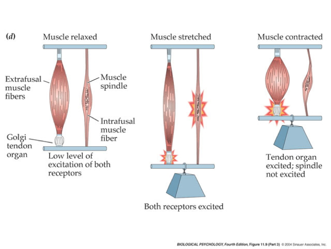

```{r, echo=FALSE}
library("DiagrammeR")
```

## Prelude {.smaller}

<iframe width="420" height="315" src="https://www.youtube.com/embed/L0CVoFsUhC4" frameborder="0" allowfullscreen></iframe>

<https://www.youtube.com/embed/L0CVoFsUhC4>

## Prelude {.smaller}

<iframe width="420" height="315" src="https://www.youtube.com/embed/XaI5IRuS2aE" frameborder="0" allowfullscreen></iframe>

<https://www.youtube.com/embed/XaI5IRuS2aE>

## Today's Topics

- The neuroscience of action
- Quiz 2 now available; due next Friday

## Muscle classes

- Axial
    + Trunk, neck, hips
- Proximal
    + Shoulder/elbow, pelvis/knee
- Distal
    + Hands/fingers, feet/toes
    
## Muscles

<div class="centered">


<http://mypages.valdosta.edu/dodrobin/2651/Muscles/Muscles.jpg>
</div>

## Muscle types

- Smooth
    + Arteries, hair follicles, uterus, intestines
    + Regulated by ANS (involuntary)
- Striated (striped)
    + Skeletal
    + Voluntary control, mostly connected to tendons and bones
- Cardiac

## Muscle types

<div class="centered">


<http://graphics8.nytimes.com/images/2007/08/01/health/adam/19917.jpg>
</div>

## How skeletal muscles contract

- Motoneuron (ventral horn of spinal cord)
- Neuromuscular junction
    + Releases ACh
    
## From spinal cord to muscle

<div class="centered">

</div>
    
## How skeletal muscles contract

- Motor endplate
    + Nicotinic ACh receptor
- Excitatory endplate potential
    + Muscle fibers depolarize
    + Depolarization spreads along fibers like an action potential
    + Sarcomeres are segments of fibers
    + Intramuscular stores release Ca++
    
## Motor endplate

<div class="centered">
<a href="http://www.siumed.edu/~dking2/ssb/images/NM040b.jpg">

</a>
</div>

## How skeletal muscles contract

- Myofibrils (w/in sarcomere)
    + Actin & mysosin proteins
    + “Molecular gears”
- Bind, move, unbind in presence of Ca++,  ATP

## Anatomy of muscle fibers

<div class="centered">

</div>

## Anatomy of motor endplate

<div class="centered">

</div>

## Muscle contraction

<iframe width="560" height="315" src="https://www.youtube.com/embed/ousflrOzQHc" frameborder="0" allowfullscreen></iframe>

## Agonist/antagonist muscle pairs

<div class="centered">


<http://2.bp.blogspot.com/-TpOC4my_NBc/T0J-MhEv29I/AAAAAAAAF88/dYLv7QzFwmg/s1600/Hamstring-Quad4.jpg>
</div>

## Meat preference?

<div class="centered">

</div>

## Muscle fiber types

- Fast twitch/fatiguing
    + Type II
    + White meat
- Slow twitch/fatiguing
    + Type I
    + Red meat
    
## Muscles are sensory organs, too!

<div class="centered">

</div>

## Two muscle fiber types

<div class="centered">

</div>

## Two muscle fiber types

- *Intrafusal* fibers
    + Sense length/tension
    + Contain muscle spindles linked to Ia afferents
    + ennervated by gamma ($\gamma$) motor neurons
- *Extrafusal* fibers
    + Generate force
    + ennervated by alpha ($\alpha$) motor neurons
    
## Monosynaptic stretch (myotatic) reflex

- Muscle stretched (length increases)
- Muscle spindle in intrafusal fiber activates
- Ia afferent sends signal to spinal cord
    + Activates alpha ($\alpha$) motor neuron
- Muscle contracts, shortens length

## Monosynaptic stetch (myotatic) reflex

<div class="centered">

</div>

- Gamma ($\gamma$) motor neuron fires to take up intrafusal fiber slack

---

<div class="centered">

</div>

<!-- Belaying as metaphor -->

## Monosynaptic stretch (myotatic) reflex

<div class="centered">

</div>

## Why doesn't antagonist muscle respond?

<div class="centered">

</div>

## Why doesn't antagonist muscle respond?

- Polysynaptic inhibition of antagonist muscle
- Prevents/dampens tremor

## Brain gets fast(est) sensory info from spindles

<div class="centered">

</div>

## How the brain controls the muscles

- Pyramidal tracts
    + Pyramidal cells (Cerebral Cortex Layer 5) in primary motor cortex (M1)
    + Corticobulbar (cortex -> brainstem) tract
    + Corticospinal (cortex -> spinal cord) tract
- Crossover (decussate) in medulla
    + L side of brain ennervates R side of body

## Corticospinal tract {.smaller} 

<div class="centered">


<https://commons.wikimedia.org/wiki/File:Gray764.png#/media/File:Gray764.png>
</div>

## How the brain controls the muscles

- Extrapyramidal system
    + Tectospinal tract
    + Vestibulospinal tract
    + Reticulospinal tract
- Involuntary movements
    + Posture, balance, arousal

## Extrapyramidal system {.smaller} 

<div class="centered">


<https://upload.wikimedia.org/wikipedia/commons/b/be/Gray672.png>
</div>

<div class="notes">
This figure shows that the descending motor pathways in red on the right have their own spatial organization depending on where they originate in the brain.
</div>

## Disorders

- Parkinson's
- Huntington's

## The Faces of Parkinson's

<iframe width="560" height="315" src="https://www.youtube.com/embed/CqEwPqUO1Bw" frameborder="0" allowfullscreen></iframe>

## Parkinson's

- Slow, absent movement, resting tremor
- Cognitive deficits, depression
- DA Neurons in substantia nigra degenerate
- Treatments
    + DA agonists
    + DA agonists linked to impulse control disorders in ~1/7 patients [[@Ramirez-Zamora2016-rl]](http://doi.org/10.1586/14737175.2016.1158103)
    + Levodopa (L-Dopa), DA precursor

## Awakenings

<div class="centered">
<a src="https://en.wikipedia.org/wiki/Awakenings">

</a>
</div>

## Huntington's

<div class="centered">

<http://cp91279.biography.com/1000509261001/1000509261001_1733824754001_woody-guthrie-centennial-1.jpg>
</div>

## Huntington's

- Formerly Huntington’s Chorea
    + "Chorea" from Greek for "dance"
    + “Dance-like” pattern of involuntary movements
- Cognitive decline
- Genetic + environmental influences
- Disturbance in striatum
- No effective treatment

## Huntington's

<iframe width="560" height="315" src="https://www.youtube.com/embed/HBLrY_nXU_U" frameborder="0" allowfullscreen></iframe>

## Remember

- Control of movement determined by multiple sources
- Cerebral cortex + basal ganglia + cerebellum + spinal circuits

## Multiple, parallel controllers

<div class="centered">

</div>

## Cerebellum as predictor of future sensory states? [[@Ito2008-ai]](http://doi.org/10.1038/nrn2332) {.smaller}

<div class="centered">


<http://venturebeat.com/wp-content/uploads/2009/10/star-trek-holodeck.jpg>
</div>

## The Real Reason for Brains

<iframe src="https://embed-ssl.ted.com/talks/daniel_wolpert_the_real_reason_for_brains.html" width="640" height="360" frameborder="0" scrolling="no" webkitAllowFullScreen mozallowfullscreen allowFullScreen></iframe>

## What does motor cortex activity encode? {.smaller} 

<div class="centered">
Muscle activity? Limb velocity? Or...?


[Shenoy et al., 2013](http://dx.doi.org/10.1146/annurev-neuro-062111-150509)
</div>

---

<div class="centered">

</div>

## Dynamic systems perspective

- Dynamics of
    - World events, $\dot W$
    - Extero- and interoceptive sensory systems, $\dot S$
    - Nervous system states, $\dot N$
    - Muscle states, $\dot M$
    - Body states, $\dot B$
    - Effects of muscles on world, $\dot W = f(\dot M)$
    
---

```{r, echo=FALSE}
grViz("digraph {
	  style=filled
		color=lightgrey
		node [style=filled, color=lightblue]
    nervous_system -> {muscles, sensors}
		sensors -> {nervous_system, muscles}
    muscles -> {sensors, world, nervous_system}
    world -> {sensors, world}
		}")
```

## Next time...

- Language

## References {.smaller}
