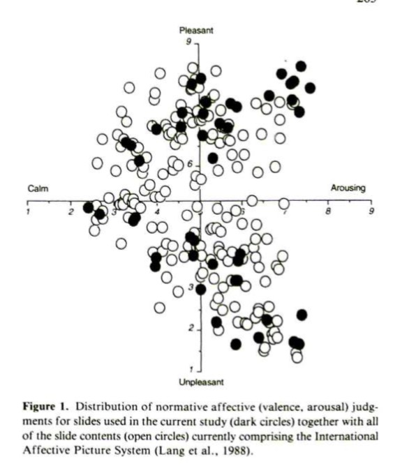
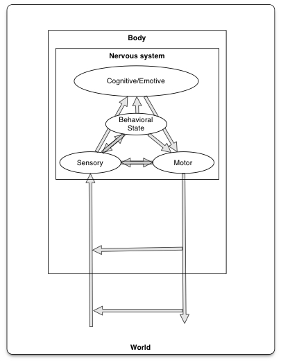

# Fun

<iframe width="560" height="315" src="https://www.youtube.com/embed/WIDYqBMFzfg" frameborder="0" allowfullscreen></iframe>

# Biology of emotion

## Components

- Perceptive vs.
    - Self
    - Others
- Performative/enactive

---

- Physiological responses
    - Autonomic
    - Endocrine
- Neural activity
- Subjective feelings
- Verbal responses
- Facial expressions
- Body movements

## Distal influences
    
- Biological goals
    + Ingestion, defense, reproduction, affiliation
- Emotions serve biological goals
    - Approach/avoid or appetitive/aversive [@Schneirla1959-hv]
    - Preservative vs. protective functions [@Knorkski1967-fv]

<!-- Darwin The Expression of Emotions in Man and Animals -->

Darwin

## Proximal causes and effects

>"*Do we run from a bear because we are afraid or are we afraid because we run? William James posed this question more than a century ago, yet the notion that afferent visceral signals are essential for the unique experiences of distinct emotions remains a key unresolved question at the heart of emotional neuroscience.*"

[[@Harrison2010-nx]](http://doi.org/10.1523/JNEUROSCI.1725-10.2010)

- [(William) James-(Carl) Lange](https://en.wikipedia.org/wiki/James%E2%80%93Lange_theory)
    - Physiological response -> subjective feelings
- [(Walter) Cannon-(Philip) Bard](https://en.wikipedia.org/wiki/Cannon%E2%80%93Bard_theory)
    - Severing CNS (spinal cord & vagus, esp SNS) from rest of body leaves emotional expression unchanged
    - Physiological states slow, don't *differentiate among emotions*
- (Stanley) Schacter-(Jerome) Singer's [Two-factor Theory](https://en.wikipedia.org/wiki/Two-factor_theory_of_emotion)
    - Physiological arousal + cognitive appraisal -> emotional states

## Dimensions

- Valence
    + Positive/negative
- Intensity (arousal)
- Action tendency
    + Approach/avoid

[@plutchik1980emotion]

## Measurement

### Autonomic Nervous System (ANS)

- Galvanic skin response (GSR)
- Skin temperature
- Pupil dilation
- Electro-gastrogram (EGG)
- Heart rate or heart rate variability (HRV)
    - *Variability* in heart period (inter-beat interval, *IBI*)
    - *Respiratory sinus arrhythmia (RSA)*: variation in IBI due to respiratory inhalation/exhalation
    - Sympathetic (SNS) and parasympathetic (PSNS) inputs converge on sinoatrial (SA) node of the heart
    - *Vagal (Xth cranial) nerve* provides PSNS input
    - *Vagal tone*: inferred effects of vagal/parasympathetic modulation of RSA (more vagal tone = more RSA)

 By <a href="//commons.wikimedia.org/w/index.php?title=User:Vivonoetics&amp;action=edit&amp;redlink=1" class="new" title="User:Vivonoetics (page does not exist)">Vivonoetics</a> - Own work, <a href="https://creativecommons.org/licenses/by-sa/3.0" title="Creative Commons Attribution-Share Alike 3.0">CC BY-SA 3.0</a>, <a href="https://commons.wikimedia.org/w/index.php?curid=14732947">Link</a>

- Evaluating cardiac measures of emotion
    - IBI controlled by sympathetic (SNS) and parasympathetic (PSNS) nervous systems
    - PSNS/vagal influences dominate @ rest, but are transient
    - RSA (normally) declines with age
    - Can measure SNS influence via [impedance cardiography](https://en.wikipedia.org/wiki/Impedance_cardiography)
    - HRV and impedance cardiography are *indirect* measures of PSNS & SNS

 By Stevan Nikolin, Tjeerd W. Boonstra, Colleen K. Loo, Donel Martin - Nikolin S, Boonstra TW, Loo CK, Martin D (2017) Combined effect of prefrontal transcranial direct current stimulation and a working memory task on heart rate variability. PLoS ONE 12(8): e0181833. <a rel="nofollow" class="external free" href="https://doi.org/10.1371/journal.pone.0181833">https://doi.org/10.1371/journal.pone.0181833</a>, <a href="http://creativecommons.org/licenses/by/2.5" title="Creative Commons Attribution 2.5">CC BY 2.5</a>, <a href="https://commons.wikimedia.org/w/index.php?curid=61549870">Link</a>

#### Covariance among ANS measures

[[@Collet1997-ln]](https://www.ncbi.nlm.nih.gov/pubmed/9021649)

>"*From the six ANS parameters studied, different autonomic patterns were identified, each characterizing one of the six basic emotion used as inducing signals. No index alone, nor group of parameters (EDR and thermovascular for instance) were capable of distinguishing each emotion from another. However, electrodermal, thermo-vascular and respiratory responses taken as a whole, redundantly separated each emotion thus demonstrating the specificity of autonomic patterns.*"

[[@Collet1997-ln]](https://www.ncbi.nlm.nih.gov/pubmed/9021649)

### Neuroendocrine

- Catecholamines (norepinephrine, epinephrine)
    - Released by adrenal medulla following sympathetic nervous system (SNS) stimulation
    - **S**ympathetic **A**drenal **M**edullary axis
    - Metabolites in urine or blood
- Corticosteroids (e.g., hydrocortisone or cortisol)
    - Released from adrenal cortex into bloodstream
    - **H**ypothalamic **P**ituitary **A**drenal (HPA) axis
    - Measured in blood, saliva, or hair

[[@Chan2010-xr]](http://dx.doi.org/10.1177/2042018810380214)

- Cortisol as *psychological* measure
    - Circadian periodicity
    - Peaks around meal times
    - Primary *physiological* role is modulating glucose & fat metabolism, anti-inflammatory

### Do the measures cohere?

[[@Lang1993-mw]](https://www.ncbi.nlm.nih.gov/pubmed/8497555)

[[@Lang1993-mw]](https://www.ncbi.nlm.nih.gov/pubmed/8497555)

### Brain activity

<iframe src="https://neurosynth.org/analyses/terms/emotional%20responses/" width=800, height=600>
</iframe>

<https://neurosynth.org/analyses/terms/emotional%20responses/>

---

<iframe src="https://neurosynth.org/analyses/terms/emotion/" width=800, height=600>
</iframe>

<https://neurosynth.org/analyses/terms/emotion/>

### Facial expression

Motta-Mena, N.V. & Scherf, K.S. (2016). Pubertal development shapes perception of complex facial expressions. Databrary. Retrieved November 8, 2019 from http://doi.org/10.17910/B7.272

### Affective prosody

<https://nyu.databrary.org/slot/12213/0,15046/asset/46757/download?inline=true>

<https://nyu.databrary.org/slot/12212/0,15046/asset/46748/download?inline=true>

Cole, P.M., Gilmore, R.O., Scherf, K.S. & Perez-Edgar, K. (2016). The Proximal Emotional Environment Project (PEEP). Databrary. Retrieved November 8, 2019 from http://doi.org/10.17910/B7.248

#### Subjective state

# Thinking about emotion

## Are emotions 'natural kinds' distinguished by the brain?

- Or are emotions "*...psychological events that emerge out of more basic psychological operations that are not specific to emotion.*" [[@Lindquist2012-jr]](http://doi.org/10.1017/S0140525X11000446)

### 'Locationist' view

Fear: amygdala (yellow); Disgust: insula (green); Anger: OFC (rust); Sadness: ACC (blue). [[@Lindquist2012-jr]](http://doi.org/10.1017/S0140525X11000446)

### 'Constructionist' view {.smaller}

Core Affect (pink): amygdala, insula, mOFC (Bas 10m, 11m, 13a, b, 14r, c), lOFC (BAs 47, 12, 13l, m, 11l), ACC (Bas, 32, 24, 25), thalamus, hypothalamus, bed nucleus of the stria terminalis, basal forebrain, PAG. Conceptualization (purple): VMPFC (Bas 11, 25, 32, 34), DMPFC (BAs 9, 10p), medial temporal lobe* (hippocampus, entorhinal cortex, parahippocampal cortex), posterior cingulate cortex/retrosplenial area (BA 23, 31). Language (green): VLPFC (Bas 44, 45, 46), anterior temporal lobe (BA 38); for additional regions, see Vigneau et al. (2006). Executive Attention (orange): DLPFC (BAs 9, 10, 46), VLPFC (BAs 44, 45, 46). [[@Lindquist2012-jr]](http://doi.org/10.1017/S0140525X11000446)

[[@Lindquist2012-jr]](http://doi.org/10.1017/S0140525X11000446)

>"*James believed that emotions, thoughts, and memories are categories derived from commonsense with instances that do not require special brain centers. With respect to emotion, he wrote, “sensational, associational, and motor elements are all that [the brain] need contain” to produce the variety of mental states that correspond to our commonsense categories for emotion (cf. James 1890/1998, p. 473)...*"

[[@Lindquist2012-jr]](http://doi.org/10.1017/S0140525X11000446)

>"*James' view foreshadowed modern psychological constructionist models of the mind and the findings of our meta-analytic review, which are largely in agreement with this approach. Our findings are consistent with the idea that emotion categories are not natural kinds that are respected by the brain.*"

[[@Lindquist2012-jr]](http://doi.org/10.1017/S0140525X11000446)

## Emotions as distributed activation states

[[@Kragel2016-pe]](http://doi.org/10.1371/journal.pbio.2000106)

[[@Kragel2016-pe]](http://doi.org/10.1371/journal.pbio.2000106)

## Other questions

- Is emotional experience discrete/unidimensional?
- Are physiological responses (ANS, endocrine, brain activity)?
- Is emotion different from cognition?

[@swanson2012brain]

[[@pessoa_relationship_2008]](http://dx.doi.org/10.1038/nrn2317)

>"*Here, I will argue that complex cognitive–emotional behaviours have their basis in dynamic coalitions of networks of brain areas, none of which should be conceptualized as specifically affective or cognitive. Central to cognitive–emotional interactions are brain areas with a high "degree of connectivity, called hubs, which are critical for regulating the flow and integration of information between regions.*"

[[@pessoa_relationship_2008]](http://dx.doi.org/10.1038/nrn2317)

[[@nummenmaa2014bodily]](http://dx.doi.org/10.1073/pnas.1321664111)

[[@nummenmaa2014bodily]](http://dx.doi.org/10.1073/pnas.1321664111)

>"*We propose that emotions are represented in the somatosensory system as culturally universal categorical somatotopic maps. Perception of these emotion-triggered bodily changes may play a key role in generating consciously felt emotions.*"

[[@nummenmaa2014bodily]](http://dx.doi.org/10.1073/pnas.1321664111)

# References {.smaller}
