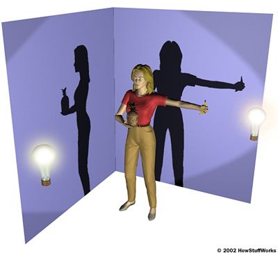
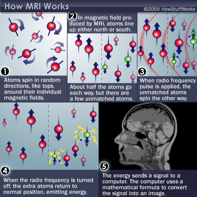
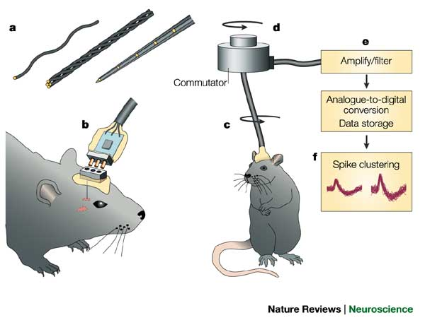
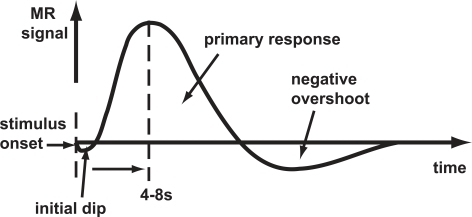
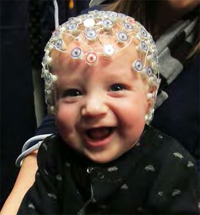
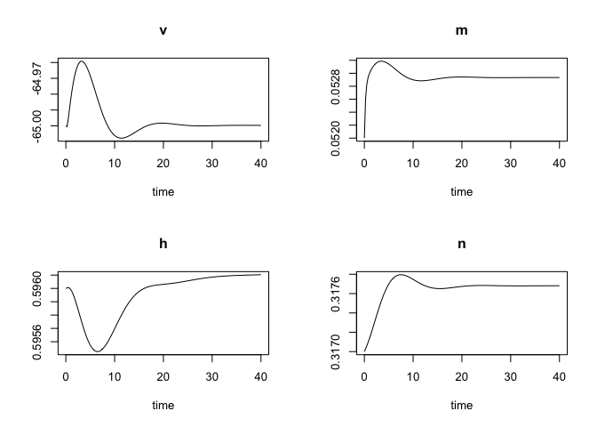

# Evaluating methods 

## What are we measuring?

- Structure
- Activity
    - Why not *function*?

## What is question are we asking?

- Structure X -> Structure Y
- Structure X -> Function Y

## Strengths & Weaknesses

- Cost
- Invasiveness
- Spatial/temporal resolution

## Spatial resolution

## Temporal resolution

[[@Sejnowski2014-aa]](https://doi.org/10.1038/nn.3839)

## Types

- Structural
  - Anatomy
  - Connectivity/connectome
- Activity/Functional
  - What does it do?
  - Physiology

# Structural methods

## Cellular

- Cell/axon stains
- Cellular types, distribution, concentration, microanatomy
- Connectivity

### Golgi stain -- whole cells, but small %

<https://connectomethebook.com/wp-content/uploads/2011/11/Brainforest17_1119.jpg>

<https://wam.umn.edu/calendar/cajal/>

**Camillo Golgi**

<https://en.wikipedia.org/wiki/Camillo_Golgi>

### Nissl stain -- only cell bodies

**[Franz Nissl](https://en.wikipedia.org/wiki/Franz_Nissl)**

### [Brainbow](https://cbs.fas.harvard.edu/science/connectome-project/brainbow)

[[@lichtman_technicolour_2008]](https://doi.org/10.1038/nrn2391)

[[@lichtman_technicolour_2008]](https://doi.org/10.1038/nrn2391)

### Clarity

<iframe width="560" height="315" src="https://www.youtube.com/embed/c-NMfp13Uug" frameborder="0" allowfullscreen></iframe>

<https://clarityresourcecenter.com/CLARITY.html>

### Tracers

- Retrograde (output -> input)
- Anterograde (input -> output)

<https://openi.nlm.nih.gov/imgs/512/348/3176268/3176268_1471-2105-12-351-2.png>

<iframe width="560" height="315" src="https://www.youtube.com/embed/nvXuq9jRWKE" frameborder="0" allowfullscreen></iframe>

### Evaluating cellular techniques

- Invasive (in humans post-mortem only)
- High *spatial* resolution, but poor/coarse *temporal*
    - Why?

## Mapping large-scale structures

### Computed axial tomography (CAT), CT

- Computed Tomography (CT)
- X-ray based

<https://img.tfd.com/mk/T/X2604-T-22.png>

**Tomography**

<https://static.howstuffworks.com/gif/cat-scan-pineapple.jpg>

<https://medium.com/datadriveninvestor/detecting-brain-hemorrhage-in-computed-tomography-ct-imaging-d1276cb6bdb7>

### Magnetic Resonance Imaging (MRI)

- Magnetic resonance a property of some isotopes and complex molecules
- Hydrogen ($H$), common in water & fat, is one
- In magnetic field, $H$ atoms absorb and release radio frequency (RF) energy
- $H$ atoms align with strong magnetic field

<https://s.hswstatic.com/gif/mri-steps.jpg>

- Applying RF pulse perturbs alignment
- Rate/timing of realignment varies by tissue
- Realignment gives off radio frequency (RF) signals
- Strength of RF ~ density of $H$ (or other target)
- K-space (frequency/phase) -> anatomical space

**Structural MRI**

- Tissue density/type differences
- **Gray matter** (nerve cells & **dendrites**) vs. **white matter** (**axon fibers**)
- Region sizes/volumes

**Spectroscopy** (specific metabolites)

**Voxel-based morphometry (VBM)**

- Quantitative analyses of size/volume
- Example: volume differences in schizophrenic patients vs. controls using statistical maps of size differences

[[@Pomarol-Clotet2010-tq]](https://dx.doi.org/10.1038/mp.2009.146)

**Diffusion Tensor Imaging (DTI)**

- Structural MRI technique
- Diffusion tensor: measurement of spatial pattern of $H_2O$ diffusion in small volume
- Uniform ("isotropic") vs. non-uniform ("anisotropic")
- Strong anisotropy suggests large # of axons with similar orientations (fiber tracts)

- Fractional Anisotropy (FA), radial diffusivity (RD), mean diffusivity (MD) measures of "non-uniformity" of diffusion tensor
- Connecting tensors or fiber tract tracing

### Connectome

- What is the wiring diagram?

# Functional (activity) methods

- Recording from the brain 
- Interfering with the brain 
- Stimulating the brain
- Simulating the brain

## Recording from the brain
### Single/multi unit recording

- Microelectrodes
- Small numbers of nerve cells

<https://www.nature.com/nrn/journal/v5/n11/images/nrn1535-i1.jpg>

- What does neuron X respond to?
- High temporal (ms) + spatial resolution (um)
- Invasive
- Rarely suitable for humans, but...

**Electrocorticography (ECoG)****

<iframe width="560" height="315" src="https://www.youtube.com/embed/HluVToAamXY" frameborder="0" allowfullscreen></iframe>

**Single-cell studies ask...**

- How does firing frequency, timing vary with behavior?

### Positron Emission Tomography (PET)

<iframe width="560" height="315" src="https://www.youtube.com/embed/GHLBcCv4rqk" frameborder="0" allowfullscreen></iframe>

- Radioactive tracers (glucose, oxygen)
- Positron decay activates paired detectors
- Tomographic techniques reconstruct 3D geometry
- Experimental condition - control
- Average across individuals
- Temporal (~ s) and spatial (mm-cm) resolution worse than fMRI
- Radioactive exposures + mildly invasive 
- Dose < airline crew exposure in 1 yr

### Functional Magnetic Resonance Imaging (fMRI)

- Neural activity -> local $O_2$ consumption increase
- *Blood Oxygen Level Dependent (BOLD)* response
- Oxygenated vs. deoxygenated hemoglobin ≠ magnetic susceptibility

- How do regional blood $O_2$ levels (& flow & volume) vary with behavior X?
- MRI "signals" relate to the speed (1/T) of "relaxation" of the perturbed nuclei to their state of alignment with the main ($B_0$) magnetic field.
- Imaging protocols emphasize different time constants of this relaxation ($T^1$, $T^2$, $T^{2*}$); $T^{2*}$ for BOLD imaging

**Evaluating fMRI**

- Non-invasive, but expensive
- Moderate but improving (mm) spatial, temporal (~sec) resolution
- Spatial limits due to 
    - field strength (@ 3T $~3mm^3$ voxel)
    - Physiology of hemodynamic response
- Temporal limits due to
    - Hemodynamic Response Function (HRF): ~ 1s delay plus 3-6 s ramp-up
    - Speed of image acquisition ($TR$ is time of image acquisition, usually 2-3s for whole brain studies)
- *Indirect* measure of neural activity

**Hemodynamic Response Function (HRF)**

**Typical analysis...**

Generate "predicted" BOLD response to event; compare to actual

Average across individual participants and plot statistical maps (in color space) on top of structural image.

<https://en.wikibooks.org/wiki/Cognitive_Psychology_and_Cognitive_Neuroscience/Behavioural_and_Neuroscience_Methods#fMRI>

**Effects of higher field strengths (3 Tesla vs. 7 Tesla)**

[[@Sladky2013-bu]](https://dx.doi.org/10.1016/j.ejrad.2011.09.025)

### Functional Near-infrared Spectroscopy (fNIRS or NIRS)

- Near infrared light penetrates scalp and skull, refracted by brain tissue
- Returned signal altered by blood $O_2$ levels
- Time course (temporal resolution) ~ BOLD fMRI; spatial resolution low

Source: https://cibsr.stanford.edu/NIRS_Lab.html

Source: https://nirx.net

### Electroencephalography (EEG)

[[@Cohen2017-og]](https://dx.doi.org/10.1016/j.tins.2017.02.004)

- How does it work?
- Electrodes on scalp or brain surface
- What do we measure?
    - Voltage *differences* between source and reference electrode
- Combined activity of huge # of neurons
- Thought to arise from current/voltage gradients between *apical* (near surface) dendrites and *basal* (deeper) dendrites and cell body/soma

<https://sfari.org/images/images-2013-folder/images-sfn-2013/20131110sfneeg>

- High temporal, poor spatial resolution
- Analyze activity in different 'bands' of frequencies
    + LOW: deep sleep (delta or $\delta$ band)
    + MIDDLE: Quiet, alert state (alpha $\alpha$ band)
    + HIGHER: Sensorimotor activity reflecting observed actions? (mu or $\mu$ band), [[@Hobson2017-oj]](https://dx.doi.org/10.1098/rsos.160662)
    + HIGHER STILL: “Binding” information across senses or plasticity? (gamma or $\gamma$ band), [[@Amo2017-tz]](https://dx.doi.org/10.1371/journal.pone.0186008)
  
**Analyze in frequency domains**

<https://www.peakmind.co.uk/images/frequency.jpg>

[[@Cohen2017-og]](https://dx.doi.org/10.1016/j.tins.2017.02.004)

**Event-related potentials (ERPs)**

- EEGs time-locked to some event 
- ...Averaged over many such events (trials)

**Brain Computer Interface (BCI)**

- May rely on EEG/ERP or electrocorticographic methods

<https://s.hswstatic.com/gif/brain-computer-interface-3.gif>

### Magneto-encephalography (MEG)

- Like EEG, but measuring magnetic fields
- High temporal resolution
- Magnetic fields propagate w/o distortion
    - But are orthogonal to electric field
- Requires shielded chamber (to keep out strong magnetic fields)
- ++ cost vs. EEG

### How do EEG/MEG and fMRI relate? {.flexbox .vcenter}

[[@Logothetis2001-ul]](https://doi.org/10.1038/35084005)

- BOLD fMRI likely reflects **presynaptic** *input* to area
- EEG/MEG likely reflects **postsynaptic** *response* to those inputs
- [[@Logothetis2001-ul]](https://doi.org/10.1038/35084005) and [[@Logothetis2004-mn]](https://doi.org/10.1146/annurev.physiol.66.082602.092845)

## Manipulating the brain

- Interfering with it 
- Stimulating it

### Interfering with the brain

- Nature’s “experiments” 
- Stroke, head injury, tumor
- Neuropsychology

**Galen**

<https://en.wikipedia.org/wiki/Galen>

**Phineas Gage**

I highly recommend the work of the late Oliver Sacks.

- Logic: IF damage to area X impairs performance, THEN region critical for behavior Y
- *Double dissociation*: Damage to area Z leaves behavior Y intact
- Weak spatial/temporal resolution

### Stimulating the brain

- Electrical (**Direct Current Stimulation - DCS**)

<https://en.wikipedia.org/wiki/Transcranial_direct-current_stimulation>

- Pharmacological
- Magnetic (**Transcranial magnetic stimulation - TMS**)

<https://en.wikipedia.org/wiki/Transcranial_magnetic_stimulation>

- Spatial/temporal resolution?
- Assume stimulation mimics natural activity?

**Deep brain electrical stimulation as therapy for...**

- Depression 
- Epilepsy
- Parkinson’s Disease 

<https://www.nimh.nih.gov/images/health-and-outreach/mental-health-topic-brain-stimulation-therapies/dbs_60715_3.jpg>

<iframe width="560" height="315" src="https://www.youtube.com/embed/KDjWdtDyz5I" frameborder="0" allow="autoplay; encrypted-media" allowfullscreen></iframe>
<https://youtu.be/KDjWdtDyz5I>

**Optogenetics**

<iframe width="560" height="315" src="https://www.youtube.com/embed/I64X7vHSHOE" frameborder="0" allowfullscreen></iframe>
<https://www.youtube.com/I64X7vHSHOE>

- Gene splicing techniques insert light-sensitive molecules into neuronal membranes
- Application of light at specific wavelengths alters neuronal function
- Cell-type specific and temporally precise control
- Mimics brain activity
- <https://en.wikipedia.org/wiki/Optogenetics>

<iframe width="560" height="315" src="https://www.youtube.com/embed/FlGbznBmx8M" frameborder="0" allow="autoplay; encrypted-media" allowfullscreen></iframe>
<https://youtu.be/FlGbznBmx8M>

## *Sim*ulating the brain

- Computer/mathematical models of brain function
- Example: neural networks
- Cheap, noninvasive, can be stimulated or “lesioned”

**Blue Brain project**

[Markram, 2006](https://doi.org/10.1038/nrn1848)

Or, here's an example of a brain-like use of artificial intelligence.

<iframe width="560" height="315" src="https://www.youtube.com/embed/gn4nRCC9TwQ" frameborder="0" allowfullscreen></iframe>

**Hodgkin-Huxley model of the action potential**

Computational neuroscience really began with a set of mathematical models of how neurons generate and send electrical messages down the axon [[@Hodgkin1952-so]](https://dx.doi.org/10.1113/jphysiol.1952.sp004764).
The graphs below simulate the time course of voltage $v$ several difference types of conductance (flow of electrical current) thought to mimic what goes on in an actual neuron.
Thanks to <https://magesblog.com/post/2012-06-25-hodgkin-huxley-model-in-r/> for the code.

## Measuring the body

- Psychophysiological measures (heart rate, respiration rate, skin conductance or electrodermal activity)
- Body position measures (eye/gaze tracking, motion tracking, electromyography or EMG)
- Endocrine (hormonal) measures

# References {.smaller}
