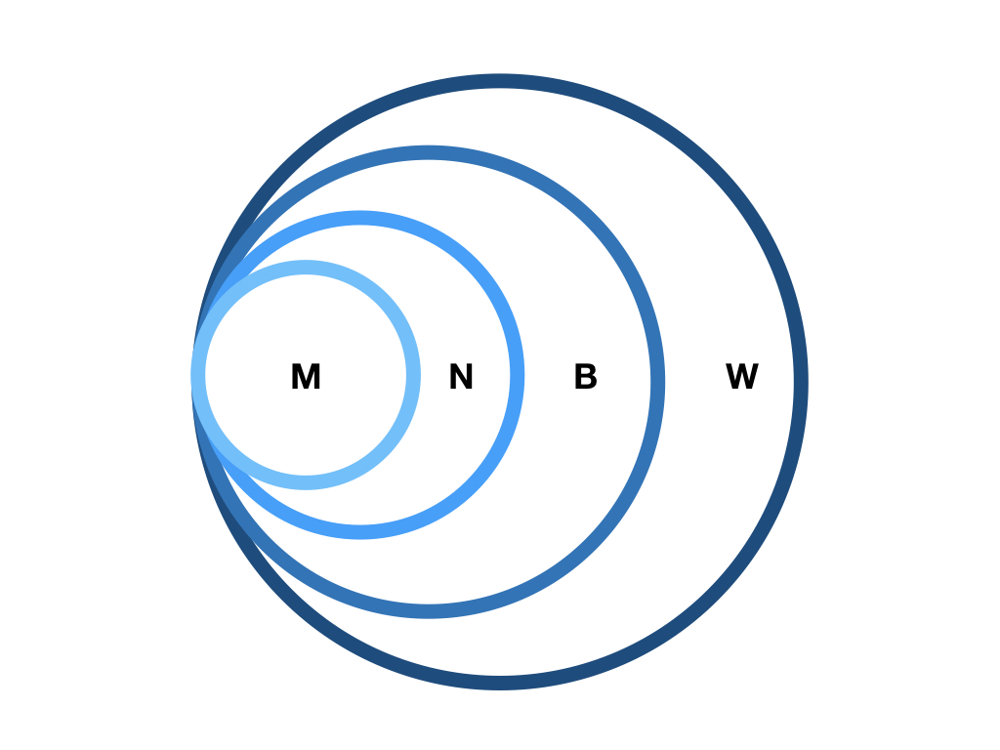
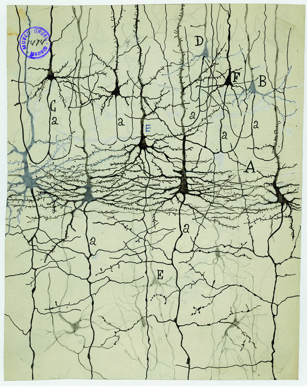

```{r set-up, include = FALSE}
knitr::opts_chunk$set(echo = FALSE, cache=TRUE, fig.align = "center")
```


## Prelude

>"*If understanding everything we need to know about the brain is a mile, how far have we walked?*"

---

<iframe width="560" height="315" src="https://www.youtube.com/embed/nvXuq9jRWKE" frameborder="0" allow="autoplay; encrypted-media" allowfullscreen></iframe>

## PSY 511 {.flexbox .vcenter}

### Foundations of Cognitive and Affective Neuroscience

<div class="centered">


Rick O. Gilmore, Ph.D.</br>
Professor of Psychology
</div>

## Today's topics

- Why neuroscience is harder than physics
- Course overview
- Methods in neuroscience

# Why neuroscience is harder than physics

---

```{r, out.width = "800px"}
knitr::include_graphics("img/psych-harder-1.jpg")
```

---

```{r, out.width = "800px"}
knitr::include_graphics("img/psych-harder-2.jpg")
```

## What do we need to know to answer the question?

- What is the state...
    - Of the world ($W$)
    - Of the organism
        - Body ($B$)
        - Nervous system ($N$)
        - Mind ($M$)

---

```{r nested-causal-realms, echo = FALSE, out.width="800px", fig.align = "center"}

```

## Some states are more easily measured than others

- $W$, $B$, $N$ more or less **directly**

---

<div class="centered">
```{r, echo=FALSE, out.width=750}
knitr::include_graphics("https://media.nature.com/lw926/nature-assets/neuro/journal/v17/n11/images/nn.3839-F1.jpg")
```

<small>
[Sejnowski, Churchland, & Movshon, 2014](http://doi.org/10.1038/nn.3839)
</small>
</div>

## Measure mental states ($M$)

- **indirectly**
- Via $N$, $B$, $W$ (+ prior beliefs/knowledge)
- Examples?

## Brain & behavior are complex, dynamic *systems* with

- Components
- Interactions
- Forces/influences
- Boundaries
- Inputs/outputs/processes

## Systems...

- "Behave" or change state across time
- Return to starting state
- Appear to be regulated, controlled, influenced by feedback loops
- $B(t+1) = f(W(t), B(t), N(t), M(t))$

## May be thought of as [networks](https://en.wikipedia.org/wiki/Network_science)

```{r, out.height=500}
knitr::include_graphics("https://d2ufo47lrtsv5s.cloudfront.net/content/sci/342/6158/1238411/F1.large.jpg")
```

## At multiple levels of organization...

<div class="centered">
```{r, out.width=700}
knitr::include_graphics("https://stats.idre.ucla.edu/wp-content/uploads/2016/02/sem_1.png")
```
</div>

## Studying systems is hard because...

- Single parts -> multiple functions
- Single functions -> multiple parts

---

<div class="centered">
```{r, out.height="500px"}
knitr::include_graphics("img/calabrese-2018.jpg")
```

[[@Calabrese2018-ve]](http://doi.org/10.1016/j.tins.2018.05.006)
</div>

## Studying systems is hard because...

- Change structure/function over time
- Biological systems not "designed" like human-engineered ones
- Hard to measure what is being exchanged, what is being controlled

# Course overview

## PSY 511.001 Goals

- Master fundamentals of neuroscientific concepts and facts
- Prepare to read primary source literature in behavioral, cognitive, affective, and clinical neuroscience

## Structure

<https://psu-psychology.github.io/psy-511-scan-fdns-2019/>

## Questions

- What is the basic organizational plan of the nervous system?
- How do neurons work?
- How do neurons connected in networks achieve behavioral goals?
- How does the nervous system develop? How has it evolved?
- How do disorders of the mind reveal themselves in the nervous system?

## Approach

- Brain architecture (neuroanatomy)
- Brain function (neurophysiology)
- Brain communication (neurochemistry)
- Changes over evolutionary and developmental time

## Approach

- The nervous system as an information processing system

---

```{r, out.width=800}
knitr::include_graphics("https://i.stack.imgur.com/3B00P.png")
```

---

### **Inputs**
- From environment, body, brain

### **Processing**
- Current inputs + brain state + body state + possible future states...
- Stored information
- Physiological & behavioral goals

---

### **Outputs**
- To brain, body, environment

## Cajal/Swanson Architecture {.flexbox .vcenter}

<div class="centered">
```{r, out.width="700px"}
knitr::include_graphics("https://raw.githubusercontent.com/psu-psychology/psy-511-scan-fdns-2017/master/lectures/img/swanson-2005-fig-1.jpg")
```

[Swanson, 2005](http://dx.doi.org/10.1002/cne.20733)
</div>

---

<div class="centered">
```{r, out.width="700px"}
knitr::include_graphics("https://raw.githubusercontent.com/psu-psychology/psy-511-scan-fdns-2017/master/lectures/img/swanson-2005-fig-3.jpg")
```

[Swanson, 2005](http://dx.doi.org/10.1002/cne.20733)
</div>

## Why neuroscience needs behavior

<div class="centered">

```{r, out.width = 750}
knitr::include_graphics("https://ars.els-cdn.com/content/image/1-s2.0-S0896627316310406-gr3.jpg")
```

[[@Krakauer2017-xl]](http://dx.doi.org/10.1016/j.neuron.2016.12.041)
</div>

---

<div class="centered">
```{r, out.width=800}
knitr::include_graphics("https://ars.els-cdn.com/content/image/1-s2.0-S0896627316310406-gr4.jpg")
```

[[@Krakauer2017-xl]](http://dx.doi.org/10.1016/j.neuron.2016.12.041)
</div>

# Neuroscience methods

## Evaluating methods 

### What are we measuring?

- Structure
- Activity
    - Why not *function*?

### What is the question?

- Structure X -> Structure Y
- Structure X -> Function Y

## Evaluating methods

### Strengths & Weaknesses

- Cost
- Invasiveness
- Spatial/temporal resolution

## Spatial resolution {.flexbox .vcenter}

<div class="centered">
```{r, out.width=600}
knitr::include_graphics("img/churchland-levels-of-analysis.gif")
```

<http://ai.ato.ms/MITECS/Images/churchland.figure1.gif>
</div>

## ...and temporal resolution {.flexbox .vcenter}

<div class="centered">
```{r, echo=FALSE, out.width=600}
knitr::include_graphics("https://media.nature.com/lw926/nature-assets/neuro/journal/v17/n11/images/nn.3839-F1.jpg")
```

[[@sejnowski2014putting]](http://doi.org/10.1038/nn.3839)
</div>

## Types of methods

### Structural 

- Anatomy
- Connectivity/connectome

### Functional (next time)

- What does it do?
- Physiology/Activity

## Mapping structures

- Cell/axon stains
- Cellular distribution, concentration, microanatomy

## **Golgi stain** -- whole cells, but small %

<div class="centered">
```{r, out.height="500px"}

```

<http://connectomethebook.com/wp-content/uploads/2011/11/Brainforest17_1119.jpg>
</div>

---

<div class="centered">
```{r, out.height="550px"}
knitr::include_graphics("https://www.hitobiotec.com/media/catalog/product/cache/1/image/9df78eab33525d08d6e5fb8d27136e95/h/i/hito_golgi_staining_10.jpg")
```

</div>

<div class="notes">
Here's a pretty one of the hippocampus.
</div>

---

<div class="centered">
```{r, out.width="650px"}
knitr::include_graphics("http://wam.umn.edu/wp-content/uploads/2016/12/WAM_Cajal_m1673.jpg")
```

<http://wam.umn.edu/calendar/cajal/>
</div>

<div class="notes">
And here is one from Santiago Ramon y Cajal.
</div>

## [Camillo Golgi](https://en.wikipedia.org/wiki/Camillo_Golgi)

<div class="centered">
```{r, out.height="550px"}
knitr::include_graphics("https://upload.wikimedia.org/wikipedia/commons/thumb/5/5f/Camillo_Golgi.jpg/330px-Camillo_Golgi.jpg")
```
</div>

## **Nissl stain**: Only cell bodies

<div class="centered">
```{r, out.height="500px"}
knitr::include_graphics("https://i.pinimg.com/originals/24/ba/58/24ba5870a0b3ac2ce8e3620853e12c8b.jpg")
```

</div>

<div class="notes">
Here's a Nissl-stained section of the macaque brain. It stains only cell bodies, but the density of staining tells us where there are lots of cells and where there are fewer.
</div>

## [Franz Nissl](https://en.wikipedia.org/wiki/Franz_Nissl)

<div class="centered">
```{r, out.height = "550px"}
knitr::include_graphics("https://upload.wikimedia.org/wikipedia/commons/d/dd/Portrait_of_Franz_Nissl.jpg")
```

</div>

## [Brainbow](http://cbs.fas.harvard.edu/science/connectome-project/brainbow)

<div class="centered">
```{r, out.width="700px"}
knitr::include_graphics("img/lichtman-nrn2391-f1.jpg")
```

[[@lichtman_technicolour_2008]](http://doi.org/10.1038/nrn2391)
</div>

## Brainbow

<div class="centered">
```{r, out.width="550px"}
knitr::include_graphics("img/lichtman-nrn2391-f2.jpg")
```

[[@lichtman_technicolour_2008]](http://doi.org/10.1038/nrn2391)
</div>

## [Clarity](http://clarityresourcecenter.com/CLARITY.html)

<iframe width="560" height="315" src="https://www.youtube.com/embed/c-NMfp13Uug" frameborder="0" allowfullscreen></iframe>

## Evaluating cellular techniques

- Invasive (in humans post-mortem only)
- High *spatial* resolution, but poor/coarse *temporal*
    - Why?

## Mapping structures

- **Computed axial tomography (CAT), CT**
- X-ray based

---

<div class="centered">
```{r, out.width="400px"}
knitr::include_graphics("img/tomography.png")
```

<http://img.tfd.com/mk/T/X2604-T-22.png>
</div>

## Tomography {.flexbox .vcenter}

<div class="centered">
```{r, out.width="500px"}
knitr::include_graphics("img/cat-scan-pineapple.jpg")
```

<http://static.howstuffworks.com/gif/cat-scan-pineapple.jpg>
</div>

---

<!-- https://medium.com/datadriveninvestor/detecting-brain-hemorrhage-in-computed-tomography-ct-imaging-d1276cb6bdb7 -->
<div class="centered">
```{r, out.width="700px"}
knitr::include_graphics("https://miro.medium.com/max/1024/1*j09PgBpdJIHXhlyjcby0HA.jpeg")
```

<small>
<https://medium.com/datadriveninvestor/detecting-brain-hemorrhage-in-computed-tomography-ct-imaging-d1276cb6bdb7>
</small>
</div>

<div class="notes">
Here's a CT image of two brains, the one on the right has an intracerebral hemorrhage.
</div>

## **Magnetic Resonance Imaging (MRI)**

- Magnetic resonance a property of some isotopes and complex molecules
- Hydrogen ($H$), common in water & fat, is one
- In magnetic field, $H$ atoms absorb and release radio frequency (RF) energy
- $H$ atoms align with strong magnetic field

---

- Applying RF pulse perturbs alignment
- Rate/timing of realignment varies by tissue
- Realignment gives off radio frequency (RF) signals
- Strength of RF ~ density of $H$ (or other target)
- K-space (frequency/phase) -> anatomical space

## MRI {.flexbox .vcenter}

<div class="centered">
```{r, out.width="450px"}
knitr::include_graphics("img/mri-steps.jpg")
```

<http://s.hswstatic.com/gif/mri-steps.jpg>
</div>

## **Structural MRI**

- Tissue density/type differences
- **Gray matter** (nerve cells & **dendrites**) vs. **white matter** (**axon fibers**)
- **Spectroscopy** (specific metabolites)
- Region sizes/volumes

---

<div class="centered">
```{r, out.height="550px"}
knitr::include_graphics("https://previews.123rf.com/images/ultimagaina/ultimagaina1405/ultimagaina140500005/28078449-Sequence-of-vertical-sections-of-a-human-brain-MRI-scan-Stock-Photo.jpg")
```
</div>

<div class="notes">
Here is an illustration of the different slices of an image sequence.
</div>

---

<div class="centered">
```{r, out.height="550px"}
knitr::include_graphics("https://images.radiopaedia.org/images/556479/0dc08a48892084b4c3b717feb9dfa4_big_gallery.jpg")
```

</div>

<div class="notes">
Here's an example of MR spectroscopy showing the concentrations of several different metabolites in a large voxel of brain tissue.
</div>

## **Voxel-based morphometry (VBM)**

<div class="centered">
Volume differences in schizophrenic patients vs. controls
</br>
```{r, out.height="400px"}
knitr::include_graphics("https://openi.nlm.nih.gov/imgs/512/130/2927029/PMC2927029_mp2009146f1.png")
```

[[@Pomarol-Clotet2010-tq]](https://dx.doi.org/10.1038/mp.2009.146)
</div>

<div class="notes">
And here's an illustration of the use of morphometric techniques. The colored portions are statistical maps placed on top of a base structural map. The statistical maps provide information about the comparison in brain volumes between patients and controls in those areas.
</div>

## What is the wiring diagram ("connectome")?

<div class="centered">
```{r, out.width="700px"}
knitr::include_graphics("https://i.stack.imgur.com/2OT3B.png")
```

</div>

<div class="notes">
The idea is analogous to electronics. We want the schematic. Without the schematic, we can't really tell what the thing does.
</div>

---

<div class="centered">
```{r, out.width="800px"}
knitr::include_graphics("img/jonas-kording-2017.jpg")
```

</div>

## Retrograde (output -> input) vs. anterograde (input -> output) tracers

<div class="centered">
```{r, out.width="400px"}
knitr::include_graphics("img/retrograde-anterograde-tracers.png")
```

<http://openi.nlm.nih.gov/imgs/512/348/3176268/3176268_1471-2105-12-351-2.png>
</div>

---

<iframe width="560" height="315" src="https://www.youtube.com/embed/nvXuq9jRWKE" frameborder="0" allowfullscreen></iframe>

## **Diffusion Tensor Imaging (DTI)**

- Structural MRI technique
- Diffusion tensor: measurement of spatial pattern of $H_2O$ diffusion in small volume
- Uniform ("isotropic") vs. non-uniform ("anisotropic")
- Strong anisotropy suggests large # of axons with similar orientations (fiber tracts)

---

<div class="centered">
```{r, out.width="700px"}
knitr::include_graphics("http://1.bp.blogspot.com/-YO3h0cRqTEc/UIRKEC_0N8I/AAAAAAAABQs/dEPzCbcyuCo/s1600/FA_tensor.png")
```

</div>

<div class="notes">
Here's an illustration of what a tensor looks like. You can see an isotropic and an anisotropic tensor.
</div>

---

<div class="centered">

</div>

<div class="centered">

</div>

## Connectome as matrix

<div class="centered">
```{r, out.height="500px"}
knitr::include_graphics("https://journals.plos.org/plosone/article/figure/image?size=large&download=&id=10.1371/journal.pone.0135247.g002")
```

</div>

---

<div class="centered">
```{r, out.width="600px"}
knitr::include_graphics("http://www.humanconnectome.org/storage/app/media/news/2015/09/CCA_mode.jpg")
```

</div>

## Main points

- Psychology is harder than physics
- Understanding brain/behavior relations requires a diverse toolkit
    - Structural vs. functional methods
    - Spatial and temporal resolution
    - Invasive vs. non-

## Your turn

#### 1. Pick two papers you want to read and (better) understand

- Email me APA formatted citation (with DOIs)
- Indicate three concepts/terms you are especially interested in understanding

---

#### 2. Choose a behavior or mental state you want to (better) understand

- Take an information processing perspective and briefly sketch out (in no more than a short paragraph) the main inputs, outputs, and computations involved.
- When thinking about *outputs* make sure to distinguish between *behaviors* (e.g., movements, facial expressions, vocalizations) and *physiological states* (e.g., changes in heart rate, hormone concentrations in the blood, etc.)

## References {.smaller}
