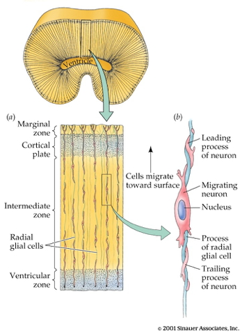
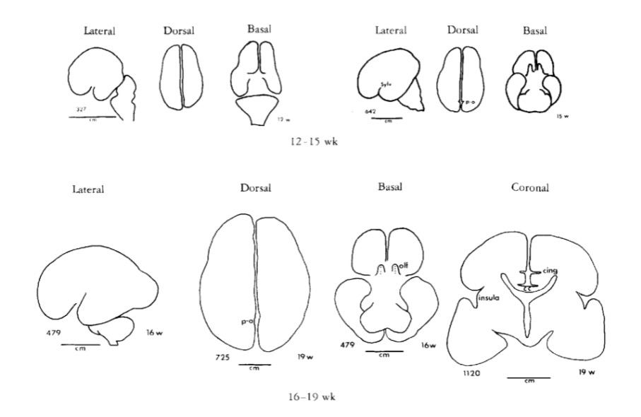

```{r set-up, echo=FALSE, error=FALSE, include=FALSE, warning=FALSE, message=FALSE}
path2figs = 'img'
knitr::opts_chunk$set(fig.path = path2figs,
                      echo = FALSE, warning = FALSE, message = FALSE,
                      fig.align = "center",
                      out.width = "800px")
library(tidyverse)
```

# Fun

<iframe width="560" height="315" src="https://www.youtube.com/embed/j6y1o6woVaY" frameborder="0" allowfullscreen></iframe>

<div class="notes">
Gentle Arms of Eden.
</div>

<iframe width="420" height="315" src="https://www.youtube.com/embed/QMshTTIp7SA" frameborder="0" allowfullscreen></iframe>

# Evolution
## Public acceptance of evolution

<div class="centered">


[[@miller2006public]](http://dx.doi.org/10.1126/science.1126746)
</div>

### Types of evidence

- Fossil
    + Fossil dating
- Geological
    + Where fossils are found relative to one another
    + How long it takes to form layers
- Genetic
    + Rates of mutation
- Anatomical

**Nothing in Biology Makes Sense Except in the Light of Evolution**

> *"Seen in the light of evolution, biology is, perhaps, intellectually the most satisfying and inspiring science. Without that light, it becomes a pile of sundry facts some of them interesting or curious, but making no meaningful picture as a whole."*
    
[[@Dobzhansky1973]](http://dx.doi.org/10.2307/4444260)

### Why Gilmore thinks the theory so controversial (in the U.S.)?

- Contradicts verbatim/non-metaphorical reading of some religious texts
- Makes humans seem less special
- Time scales involved beyond human experience
- Scientific method vs. other ways of knowing
- Found in nature ≠ good for human society
- Few negative consequences of 'disbelief'
- U.S. culture individualistic, skeptical, anti-elitist/anti-intellectual
- Lower levels of religious belief among [U.S. scientists](http://news.rice.edu/2015/12/03/first-worldwide-survey-of-religion-and-science-no-not-all-scientists-are-atheists/)
- [Politics](http://www.people-press.org/2009/07/09/section-4-scientists-politics-and-religion/)
- A minority of citizens support teaching [evolution-only](http://www.pbs.org/wgbh/nova/blogs/education/2015/12/evolutionschools/) 
- Majority of classroom teachers aren't [strong advocates](https://www.sciencedaily.com/releases/2011/01/110127141657.htm)

## Evolution and development

### Ontogenesis and phylogenesis

- *Ontogenesis*
    + Development within lifetimes, history of individuals
- *Phylogenesis*
    + Change across lifestimes, history of species

#### Ontogeny does not recapitulate phylogeny ([Haeckel](https://en.wikipedia.org/wiki/Ernst_Haeckel)), but...

<div class="centered">


<https://upload.wikimedia.org/wikipedia/commons/thumb/0/08/Haeckel_drawings.jpg/350px-Haeckel_drawings.jpg>
</div>

### Complex multicellular life emerged "recently"

<div class="centered">


<http://www.zo.utexas.edu/faculty/sjasper/images/26.2.gif>
</div>

<div class="centered">


<http://www.indiana.edu/~geol105b/images/gaia_chapter_6/time_scale.gif>
</div>

### Nervous system architectures

<div class="centered">

</div>

#### An animal with a nerve "net"

<iframe width="420" height="315" src="https://www.youtube.com/embed/-UI531GMRTM" frameborder="0" allowfullscreen></iframe>

#### How nervous systems differ

- Body symmetry
    + radial
    + bilateral
- Segmentation
- Cephalization (concentration of sensory & neural structures in anterior portion of body)
- Encasement in bone (vertebrates)
- Centralized vs. distributed function

#### Cephalopods have "intelligent arms"

<iframe width="700" height="400" src="http://www.sciencedirect.com/science/article/pii/S0022098113000683" frameborder="0" allowfullscreen></iframe>

### What nervous systems must do: Biological computation

- Ingestion
- Defense
- Reproduction

<div class="centered">

</div>

#### Information processing universals

- Sense/detect
    + Sensors
- Analyze, evaluate, decide
- Act
    + Effectors
    + e.g., approach/avoid, manipulate, ingest, signal

#### Sensors

- Specialize by information source/type
- Specialize by target location
    + Interoceptive
    + Exteroceptive
    
#### Analysis, evaluation, decision

- Current state
    + World
    + Organism
- Current goals
- Past state(s)

#### Effectors

- Move body
- Send signals
- Change physiological state

### From nerve net to nerve ring, nerve cord and brain 
[[@arendt_nerve_2016]](http://doi.org/10.1038/nrn.2015.15)

<div class="centered">

</div>

<div class="centered">

</div>

- Neurons and nervous systems 520-570 M years old
- Similarities at molecular level in how diverse nervous systems develop

### Vertebrate CNS organization

<div class="centered">

</div>

---

<div class="centered">


[[@Northcutt2002-jg]](http://doi.org/10.1093/icb/42.4.743)
</div>

<div class="centered">
<a href="http://neurosciencelibrary.org/evolution/paleo/images/BrnBodwt6.jpg">

</a>
</div>

<div class="centered">


[[@Northcutt2002-jg]](http://doi.org/10.1093/icb/42.4.743)
</div>

<div class="centered">


[@hofman_evolution_2014]
</div>

| Structural measure | Non-human comparison | Human |
|--------------------|----------------------|-------|
| Cortical gray matter %/tot brain vol | insectivores 25% | 50% |
| Cortical gray + white | mice 40% | 80% |
| Cerebellar mass | primates, mammals 10-15% | 10-15% |

<div class="centered">


[[@rakic2009evolution]](http://dx.doi.org/10.1038/nrn2719)
</div>

<div class="centered">


[[@hofman_evolution_2014]](http://journal.frontiersin.org/article/10.3389/fnana.2014.00015/full)
</div>

**Take homes**

- Brain sizes scale with body size
- Brain sizes scale with animal class (more or less)

**Old story**

- Within mammals, human brains bigger than expected
    - Higher encephalization quotient
- Humans have larger cerebral cortical gray + white matter than comparable mammals

**vs. New story**

- Does brain size/mass matter (that much)?
- "Size matters" (brain mass) presumes similarity among brains at micro-level
- Big (large mass) brains arise in multiple animal lineages

---

<div class="centered">
<a href="http://www.pnas.org/content/109/Supplement_1/10661/F1.expansion.html">

</a>
</div>

- *# of cortical neurons* more important difference than brain mass
- The primate advantage -> more cortical neurons, but not larger neurons
- Human brain just scaled up (non-ape) primate brain

---

<div class="centered">
<a href="http://www.pnas.org/content/109/Supplement_1/10661/F3.expansion.html">

</a>
</div>

**# of cortical (or in birds, pallidum) neurons predicts "cognition"?**

<div class="centered">


[[@Herculano-Houzel2017-gf]](http://doi.org/10.1016/j.cobeha.2017.02.004)
</div>

**The Human Advantage [@Herculano-Houzel2016-oy]**

- More neurons in cerebral cortex than other animals, but not disproportionately so
- Less time spent foraging
    + Higher quality/more energetically dense food
    + Higher food availability
    + Cultural factors (agriculture + cooking)
    + See also [@Wrangham2009-vq]
    
**A further human advantage**

<div class="centered">

</div>

# Human brain development

## Prenatal brain development

### Insemination

- 3-4 days before or up to 1-2 days after...
    + Ovulation

### Fertilization

- Within ~ 24 hrs of ovulation

### Implantation

- ~ 6 days after fertilization

### Early embryogenesis

<iframe width="560" height="315" src="https://www.youtube.com/embed/dAOWQC-OBv0" frameborder="0" allowfullscreen></iframe>

### Formation of *neural tube* (neurulation)

- Embryonic layers: ectoderm, mesoderm, endoderm
- ~18-26 days
- Failures of neural tube closure
    + Spina bifida
    + Anencephaly
- Neural tube becomes
    + Ventricles
    + Central canal of spinal cord

### Neurogenesis and gliogenesis

- Neuroepithelium cell layer lines neural tube
- Neural stem cells 
      - Undergo symmetric & asymmetric cell division
      - Generate glia, neurons, and basal progenitor cells

<div class="centered">


[[@Gotz2005-yj]](http://doi.org/http://dx.doi.org/10.1038/nrm1739)
</div>

**Zika and microcephaly**

<iframe src="http://www.cdc.gov/ncbddd/birthdefects/microcephaly.html">
</iframe>

### Radial glia

<div class="centered">

</div>

### Cell migration

<div class="centered">

</div>

### Radial unit hypothesis

<div class="centered">


[[@rakic2009evolution]](http://dx.doi.org/10.1038/nrn2719)
</div>

### Migration

<iframe width="420" height="315" src="https://www.youtube.com/embed/ZRF-gKZHINk" frameborder="0" allowfullscreen></iframe>

<iframe width="420" height="315" src="https://www.youtube.com/embed/t-8bxeWqSV4" frameborder="0" allowfullscreen></iframe>

### Glial migration

<div class="centered">


[[@Baumann2001-nw]](http://dx.doi.org/10.1152/physrev.2001.81.2.871)
</div>

### Axon growth cone

<iframe width="420" height="315" src="https://www.youtube.com/embed/Fgmt2RBow0I" frameborder="0" allowfullscreen></iframe>

**Axons follow**

- Chemoattractants
    + e.g., Nerve Growth Factor (NGF)
- Chemorepellents
- Receptors in growth cone detect chemical gradients

## Differentiation

- Neuron vs. glial cell
- Cell type
- NTs released
- Where to connect

**Differential gene expression in PFC vs. other**

<div class="centered">


[[johnson2009functional]](http://dx.doi.org/10.1016/j.neuron.2009.03.027)
</div>

## Infancy & Early Childhood

### Synaptogenesis

<div class="centered">

</div>

### Proliferation, pruning

- Early proliferation
- Later pruning
- Rates, peaks differ by area

### Apoptosis

- Programmed cell death
- 20-80%, varies by area
- Spinal cord >> cortex
- Quantity of nerve growth factors (NGF) influences

<div class="centered">


[[@rakic2009evolution]](http://dx.doi.org/10.1038/nrn2719)
</div>

### Synaptic rearrangement

<div class="centered">

</div>

- Progressive phase: growth rate >> loss rate
- Regressive phase: growth rate << loss rate

### Myelination

<div class="centered">


[[@Baumann2001-nw]](http://dx.doi.org/10.1152/physrev.2001.81.2.871)
</div>

- Neonatal brain largely unmyelinated
- Gradual myelination, peaks in mid-20s
- Non-uniform pattern
    - Spinal cord before brain
    - Sensory before motor
    
### Gyral development

<div class="centered">


[[@Chi1977-hm]](http://doi.org/10.1002/ana.410010109)
</div>

<div class="centered">


[[@Chi1977-hm]](http://doi.org/10.1002/ana.410010109)
</div>

<div class="centered">


[[@Chi1977-hm]](http://doi.org/10.1002/ana.410010109)
</div>

<div class="centered">


[[@Chi1977-hm]](http://doi.org/10.1002/ana.410010109)
</div>

### Structural development

<div class="centered">


[[@Knickmeyer2008-vl]](http://doi.org/10.1523/JNEUROSCI.3479-08.2008)
</div>

### Postnatal patterns of synaptogenesis

<div class="centered">

</div>

### Myelination across human development

<div class="centered">


[[@Hagmann02112010]](http://doi.org/10.1073/pnas.1009073107)
</div>

## Networks in the brain

<div class="centered">


[[@10.3389/fnhum.2014.00051]](http://doi.org/10.3389/fnhum.2014.00051)

### Functional connectivity

- Age-related increases within visual-related areas [[@Petrican2017-re]](http://doi.org/10.1016/j.neuroimage.2017.09.025)

---

<div class="centered">
<a href="https://ars.els-cdn.com/content/image/1-s2.0-S1053811917307735-gr2a_lrg.jpg">

</a>
</div>

---

<div class="centered">
<a href="https://ars.els-cdn.com/content/image/1-s2.0-S1053811917307735-gr2b_lrg.jpg">

</a>
</div>

<div class="notes">
Age-related profiles in connectivity among "control networks."
</div>

---

<div class="centered">
<a href="https://ars.els-cdn.com/content/image/1-s2.0-S1053811917307735-gr2c_lrg.jpg">

</a>
</div>

<div class="notes">
Age-related profiles in connectivity among "non-control networks."
</div>

### The "development" of developmental connectomics

<div class="centered">
<a href="https://ars.els-cdn.com/content/image/1-s2.0-S0166223617301157-gr2_lrg.jpg">

</a>

[[@Cao2017-bl]](http://doi.org/10.1016/j.tins.2017.06.003)
</div>

### Myelination changes "network" properties

<div class="centered">


[[@Hagmann02112010]](http://doi.org/10.1073/pnas.1009073107)
</div>

### Synaptic rearrangment, myelination change cortical thickness

- [[@Gogtay2004-bq]](http://doi.org/10.1073/pnas.0402680101)
- Areal differences in cortical thickness change

[[@Gogtay2004-bq]](http://doi.org/10.1073/pnas.0402680101)

<video width="320" height="240" controls>
  <source src="mov/02680Movie1.mp4" type="video/mp4">
Your browser does not support the video tag.
</video>

<video width="320" height="240" controls>
  <source src="mov/02680Movie2.mp4" type="video/mp4">
Your browser does not support the video tag.
</video>

<video width="320" height="240" controls>
  <source src="mov/02680Movie3.mp4" type="video/mp4">
Your browser does not support the video tag.
</video>

<video width="320" height="240" controls>
  <source src="mov/02680Movie4.mp4" type="video/mp4">
Your browser does not support the video tag.
</video>

---

<div class="centered">

[[@Shaw2008-dq]](https://doi.org/10.1523/JNEUROSCI.5309-07.2008)
</div>

<div class="notes">
Sampling in Shaw et al 2008 study
</div>

---

<div class="centered">


[[@Shaw2008-dq]](https://doi.org/10.1523/JNEUROSCI.5309-07.2008)
</div>

<div class="notes">
Illustrations of cubic, quadratic, and linear changes in cortical thickness.
</div>

---

<div class="centered">


[[@Shaw2008-dq]](https://doi.org/10.1523/JNEUROSCI.5309-07.2008)
</div>

<div class="notes">
Illustrations of cubic, quadratic, and linear changes in cortical thickness from Shaw et al. 2008.
</div>

---

<div class="centered">


[[@Shaw2008-dq]](https://doi.org/10.1523/JNEUROSCI.5309-07.2008)
</div>

<div class="notes">
Illustrations of cubic, quadratic, and linear changes in medial frontal lobe cortical thickness from Shaw et al. 2008.
</div>

<!-- Scrolling final reference page -->
<!-- http://stackoverflow.com/q/38260799 -->
<style>
slides > slide { overflow: scroll; }
slides > slide:not(.nobackground):before {
  background: none;
  }
slides > slide:not(.nobackground):after {
  content: '';
  background: none;
  }
}
</style>

### Changes in brain energetics

<div class="centered">
<a href="http://www.pnas.org/content/111/36/13010/F1.medium.gif">

</a>

[[@Kuzawa2014-qd]](http://doi.org/10.1073/pnas.1323099111)
</div>

<div class="notes">
Glucose utilization across age.
</div>

### Gene expression across development

<div class="centered">


[[@Kang2011-ex]](http://doi.org/10.1038/nature10523)
</div>

## Summary of developmental milestones

### Prenatal

+ Neuro- and gliogenesis
+ Migration
+ Synaptogenesis begins
+ Differentiation
+ Apoptosis
+ Myelination begins
+ Infant gene expression ≠ Adult

### Postnatal

+ Synaptogenesis
+ Cortical expansion, activity-dependent change
- Then cubic, quadratic, or linear declines in cortical thickness
+ Myelination
+ Connectivity changes (esp within networks)
+ Prolonged period of postnatal/pre-reproductive development [[@konner_evolution_2011]](http://www.hup.harvard.edu/catalog.php?isbn=9780674062016)

## How brain development clarifies anatomical structure

### 3-4 weeks

<div class="centered">

</div>

### 4 weeks

<div class="centered">


<https://upload.wikimedia.org/wikipedia/commons/4/4c/4_week_embryo_brain.jpg>
</div>

### ~4 weeks

<div class="centered">

</div>

### 6 weeks

<div class="centered">


<https://upload.wikimedia.org/wikipedia/commons/thumb/3/33/6_week_human_embryo_nervous_system.svg/500px-6_week_human_embryo_nervous_system.svg.png>
</div>

<div class="centered">

</div>

### Beyond 6+ weeks

<div class="centered">

</div>

### Organization of the brain

| Major division | Ventricular Landmark | Embryonic Division | Structure       |
|----------------|----------------------|--------------------|-----------------|
| Forebrain      | Lateral              | Telencephalon      | Cerebral cortex |
|                |                      |                    | Basal ganglia   |
|                |                      |                    | Hippocampus, amygdala |
|                | Third                | Diencephalon       | Thalamus        |
|                |                      |                    | Hypothalamus    |
| Midbrain       | Cerebral Aqueduct    | Mesencephalon      | Tectum, tegmentum |
| Hindbrain      | 4th                  | Metencephalon      | Cerebellum, pons  |
|                | --                   | Mylencephalon      | Medulla oblongata |

### From structural development to functional development

<div class="centered">


[[@Johnson2001-yy]](http://doi.org/10.1038/35081509)
</div>

# References


